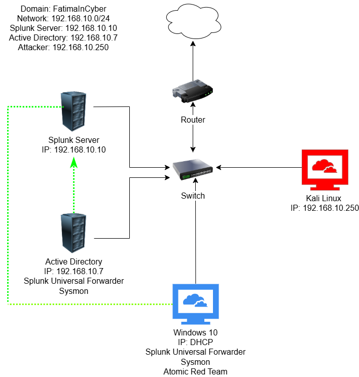

# Active-Directory-Attack-Detection-Threat-Telemetry-Lab
*Windows Server 2022 | Active Directory | Splunk SIEM | Sysmon | Kali Linux | Atomic Red Team*


## Project Overview
*This project simulates a realistic enterprise Active Directory environment where an attacker performs brute-force login attempts against domain users. The attack is detected using endpoint telemetry collected via Sysmon and analyzed in Splunk.*

---



---

The lab replicates a real-world SOC environment where:
- A domain controller manages identity and authentication
- Endpoints generate telemetry using Sysmon
- Logs are forwarded to a centralized SIEM (Splunk)
- Attacks are simulated using Kali Linux and Atomic Red Team
- Security events are detected and investigated using log analysis

The objective was to demonstrate how Security Operations Centers (SOCs) monitor authentication activity, detect suspicious behavior, and investigate attacks using log data and threat intelligence frameworks.

---

## Value & Impact of the Lab

This lab provides hands-on experience with:

- Simulating real-world Active Directory attacks
- Understanding authentication-based attack vectors
- Building a SOC-like detection pipeline
- Analyzing logs using SIEM tools
- Mapping activity to MITRE ATT&CK techniques

It bridges the gap between theoretical cybersecurity concepts and practical detection workflows used in real environments.

---

## Lab Architecture
### Environment Components

| Component | Role |
|----------|------|
| Windows Server 2022 | Active Directory Domain Controller (ADDC01) |
| Windows 10 | Domain-joined endpoint (Target Machine) |
| Ubuntu Server | Splunk SIEM |
| Kali Linux | Attacker machine |

### Network Configuration

- Network: 192.168.10.0/24
- Domain: fatimacyber.local
- AD Server: 192.168.10.7
- Splunk Server: 192.168.10.10
- Attacker (Kali): 192.168.10.250

---

## Key Components Explained

#### Active Directory (AD):
Centralized identity management system used for authentication and authorization.

#### Splunk (SIEM):
Log analysis platform used to collect, search, and visualize security events.

#### Splunk Universal Forwarder:
Lightweight agent that sends logs from endpoints to the Splunk server.

#### Sysmon:
Advanced Windows logging tool that records process creation, network connections, and system activity.

#### Kali Linux:
Attacker machine used to simulate brute-force attacks.

#### Hydra:
Password-cracking tool used to perform RDP brute-force attacks.

#### Atomic Red Team:
Tool used to simulate real-world attacker techniques mapped to MITRE ATT&CK.

---

## Phase 1 — Network & Splunk Setup
*Configured all virtual machines under a single NAT network (AD-Project) for communication.*

Installed Splunk on Ubuntu:

```bash
wget -O splunk-installer.deb "https://download.splunk.com/..."
sudo dpkg -i splunk-installer.deb
sudo /opt/splunk/bin/splunk start --accept-license
```
Purpose: 
* Central platform for log ingestion, indexing, and analysis. 

### Configure receiving port:

Settings → Forwarding & Receiving → Add Port **9997**

Purpose:
* Allows Splunk to receive logs from forwarders.


### Create Index
Index Name: *"endpoint"*

Purpose:
* Stores endpoint security logs separately for easier analysis.

---

## Phase 2 - Endpoint Telemetry (Windows + AD)

### Install Splunk Universal Forwarder
- Installed on:
  - Windows 10
  - Active Directory Server

Purpose:
* Forwards logs from endpoints to Splunk server.

### Configure Forwarder (inputs.conf)
Destination: ```192.168.10.10:9997```

Edited inputs.conf:
```bash
[WinEventLog://Security]
[WinEventLog://System]
[WinEventLog://Application]
[WinEventLog://Microsoft-Windows-Sysmon/Operational]
```

Purpose:
* Collect system, security, and Sysmon logs.

Restarted service:
```bash
net stop splunkforwarder
net start splunkforwarder
```
Changed service logon settings:
- Set "Log on as" → Local System Account

Purpose:
* Ensures proper permission to collect system and security logs without restriction.

---

## Phase 3 — Sysmon Installation
Installed Sysmon using a community configuration file:

- Downloaded Sysmon configuration from GitHub.
- Applied configuration during installation
```bash
sysmon.exe -i sysmonconfig.xml
```
Purpose:
* Predefined rules to capture relevant security events such as process creation, network connections, and suspicious activity.

---

## Phase 4 — Active Directory Setup (Windows Server 2022)
*Installed AD Domain Services and promoted server to Domain Controller.*
* Server Manager → Add Roles → Active Directory Domain Services

Purpose:
* Enables domain-based authentication and identity management.

#### Promote to Domain Controller

Created new domain:
```bash
fatimacyber.local
```

#### Created Organizational Units & Users:

- OU: IT → User: ```Roshni Anwar```
- OU: HR → User: ```Faaran Sikandar```

Purpose:
* Simulates real organizational structure.

---

## Phase 5 — Domain Join (Windows 10)

System Settings → About → Domain 

#### Initial Error:
- Domain controller could not be contacted

#### Resolution:

Changed DNS to AD server IP:
```bash
192.168.10.7
```
After joining the domain:
- Logged in using domain credentials (same as AD server administrator)
- Then logged in as domain user: Roshni Anwar
- Restarted system to apply domain policies

Purpose:
* Validates domain authentication and user access within AD environment.

---

## Phase 6 - Attack Simulation (Brute Force)

#### RDP Configuration on Target Machine

Enabled Remote Desktop Protocol (RDP) on Windows 10 target machine.

Added users:
- Roshni Anwar
- Faaran Sikandar

Purpose:
* Allows remote authentication attempts, enabling brute-force attack simulation.

#### Install brute forcing tool (Crowbar)
```bash
sudo apt-get install -y crowbar
```
Created the password file
```bash
cd /usr/share/wordlists/
sudo gunzip rockyou.txt.gz
cp rockyou.txt ~/Desktop/ad-project
cd /Desktop/ad-project
head -n 20 rockyou.txt > passwords.txt
```
Add the targeted account password to the passwords.txt file.

(Encountered multiple errors while using Crowbar, so switched to Hydra for more reliable execution.)

```bash
hydra -t 1 -l Roshni -P passwords.txt (TARGET-IP) rdp
```

### Result
- Multiple failed logins (Event ID 4625)
- One successful login (Event ID 4624)

Purpose:
* Simulate brute-force attack against RDP service.

---

## Phase 7 - Detection in Splunk
#### Failed Logins (Event ID 4625)
```bash
index=endpoint EventCode=4625
```
Shows:
- Failed login attempts
- Source IP (Kali attacker: 192.168.10.250)
- Target account being attacked

#### Successful Login (Event ID 4624)
```bash
index=endpoint EventCode=4624
```
Shows:
- Successful compromise
- Authentication details

---

## Phase 8 - Atomic Red Team Simulation
*Installed Atomic Red Team on Target Machine (Windows Endpoint)*

#### Run Test
```bash
Invoke-AtomicTest T1136.001
```

Purpose:
- Simulates Local account creation

#### Detection in Splunk
Logs showed:
- New user creation
- Privilege escalation
- Full event timeline

#### Value
Maps directly to MITRE ATT&CK techniques.

---

## Screenshots & Full Walkthrough
Complete step-by-step screenshots (66 images) documenting:
- Installation
- Configuration
- Errors encountered
- Troubleshooting process

Available in:

[All Screenshots](./screenshots/)

---

## Key Takeaways

- Centralized logging is critical for detection
- Authentication logs reveal brute-force attacks
- DNS misconfiguration can break domain connectivity
- Attack simulation helps validate detection capabilities
- Troubleshooting builds real-world SOC skills

---

## Challenges & Troubleshooting

During this lab, several issues were encountered:

- Domain join failure due to incorrect DNS configuration
- Splunk forwarder not sending logs due to service permissions
- Crowbar brute-force tool errors
- Log ingestion delays and indexing issues

Resolution involved:
- Debugging configurations
- Reviewing documentation
- Testing multiple approaches

This process significantly improved troubleshooting and problem-solving skills.

---

## Conclusion

This lab demonstrates how attackers target Active Directory environments and how defenders detect such activity using endpoint telemetry and SIEM tools. It highlights the importance of monitoring authentication events and understanding attacker behavior through logs.
